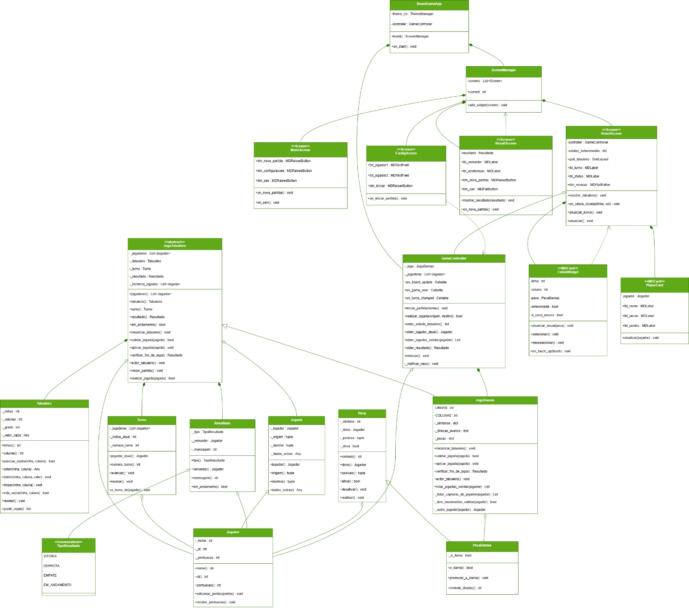

# ♟ Jogo de Damas — POO Fase 2

**Disciplina:** Programação Orientada a Objetos  
**Faculdade:** FATEC Ribeirão Preto  
**Integrantes:** Rodrigo de Azevedo Junior; Davi Sousa Cirilo
**Turma:** 4 semestre / Manhã

---

## Descrição

Jogo de Damas brasileiro implementado em Python com interface gráfica KivyMD (Material Design).  
Este projeto é a Fase 2 do projeto semestral, adicionando interface visual à lógica OO da Fase 1.

---

## Instalação

```bash
# 1. Clone do repositório
git clone https://github.com/seu-usuario/poo-jogo-damas.git
cd poo-jogo-damas

# 2. Criacao do ambiente virtual venv
python -m venv venv
venv\Scripts\activate

# 3. Instale as dependências
pip install kivymd==1.1.1
pip install kivy[base]

# 4. Execute o jogo
python main.py
```

---

## Como Jogar

1. Na tela de **Menu Principal**, clique em **Nova Partida**.
2. Na tela de **Configuração**, insira os nomes dos dois jogadores e clique em **Iniciar Partida**.
3. No **Tabuleiro**:
   - Clique em uma peça sua (branca ou preta) para selecioná-la — os destinos válidos aparecem destacados em azul.
   - Clique em um destino válido para mover.
   - Se houver capturas disponíveis, apenas capturas são aceitas (regra obrigatória).
   - Peças que chegam à última fileira são promovidas a **Dama** (indicada por anel dourado).
4. Ao fim da partida, a tela de **Resultado** exibe o vencedor.

---

## Estrutura do Projeto

```
├── main.py                         # Ponto de entrada KivyMD
├── requirements.txt                # Dependências Python
├── README.md
├── .gitignore
├── app/
│   ├── controllers/
│   │   └── game_controller.py      # Bridge entre View e Model
│   ├── views/
│   │   ├── menu_screen.py          # Tela de menu principal
│   │   ├── config_screen.py        # Tela de configuração de partida
│   │   ├── board_screen.py         # Tela do tabuleiro (jogo em si)
│   │   └── result_screen.py        # Tela de resultado
│   └── components/                 # Widgets reutilizáveis
├── src/
│   ├── core/                       # Classes base (Fase 1 — intactas)
│   │   ├── jogador.py
│   │   ├── peca.py
│   │   ├── jogada.py
│   │   ├── tabuleiro.py
│   │   ├── jogo_tabuleiro.py
│   │   ├── turno.py
│   │   └── resultado.py
│   └── jogos/
│       └── damas/
│           ├── jogo_damas.py       # Lógica do jogo de Damas (Fase 1 — intacta)
│           ├── peca_damas.py
│           └── UI/
│               └── terminal.py     # UI de terminal (mantida da Fase 1)
├── assets/
│   └── images/
├── slides/                         # PDF da apresentação (adicionar aqui)
└── tests/                          # Testes unitários (Fase 1)
```

---

## Arquitetura

O projeto segue o padrão **MVC (Model-View-Controller)**:

- **Model** (`src/`): Classes da Fase 1 sem modificação — `JogoDamas`, `Tabuleiro`, `Jogador`, etc.
- **View** (`app/views/`): Telas KivyMD que apenas exibem o estado e capturam eventos do usuário.
- **Controller** (`app/controllers/game_controller.py`): Intermediário que traduz eventos da UI em chamadas ao modelo, nunca expondo atributos internos.

---

## Uso de IA

Utilizamos o ClaudeAI para:

- Geração da estrutura do README
- Sugestões de padrões MVC aplicados ao KivyMD
- Correções de bugs
- Explicação de algumas funcionalidades

---

## Diagrama UML


